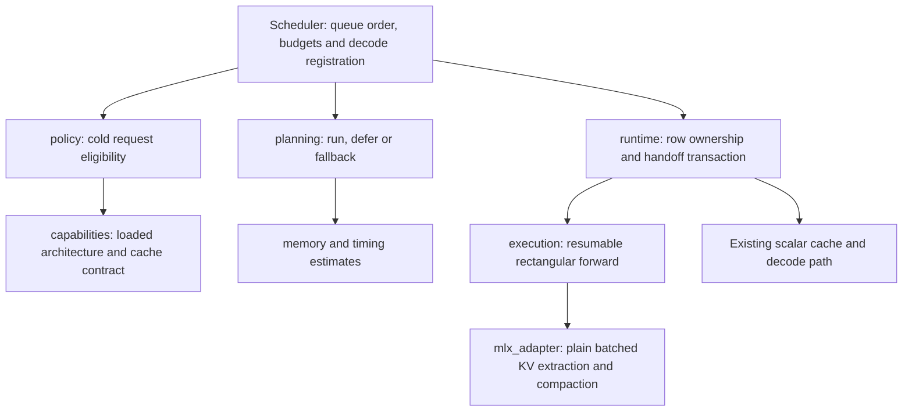

# Opt-in batched prefill (Hy-MT2 v1)

Batched prefill lets eligible cold text requests share a model forward pass.
The default maximum width is **1**, preserving scalar prefill. Hy-MT2 uses
MLX-LM's `hy_v3` implementation; support is checked against the loaded model,
including normal oMLX gate/up expert fusion, rather than its repository name.
A supported architecture is not a promise of a speedup for every checkpoint.

## Configuration

Keep the global default at 1 and enable only the model being qualified. Using
an authenticated admin session, update the physical model's settings:

```http
PUT /admin/api/models/{model_id}/settings
Content-Type: application/json

{"prefill_max_batch_size": 4}
```

- `null`: inherit the global scheduler setting.
- `1`: disable new prefill groups for this model.
- Any integer greater than 1: maximum eligible group width; try 2 and 4 first.
- Omit the field to retain its current value. Zero, booleans and non-integers
  are rejected.

The persisted global setting is `scheduler.prefill_max_batch_size`. The admin
`POST /admin/api/global-settings` endpoint accepts the flat field
`prefill_max_batch_size`. Global updates affect inheriting models and preserve
explicit model overrides. Each loaded engine receives its own scheduler config.
Updates require no model reload: admission reads the new limit at the next
scheduler turn; existing groups drain safely. This setting belongs to the
physical model, and is excluded from model profiles/templates. There is no
separate UI control in this version.

The `speed` prefill-priority mode retains its scalar path. Use the default
`context` priority when qualifying batching.

A width is an upper bound, not a reservation. The scheduler does not wait to
collect requests. Fewer available rows, token budgets, decode contention and
memory headroom can reduce or prevent batching. A process memory limit must be
available for admission; an unavailable estimate keeps scalar execution.

## Implementation boundaries



| Module | Responsibility |
| --- | --- |
| `models/` | One explicit adapter table; each family owns its argument schema and loaded-model validator. Shared helpers check local affine weights and execution flags. |
| `capabilities.py` | Resolve the adapter and verify the exact runtime class, common execution restrictions and plain-KV contract. |
| `geometry.py` | Model-independent attention/expert dimensions and validation, without MLX imports. |
| `policy.py` | Inspect the actual request and cache after prefix lookup without mutating them. |
| `planning.py` | Select a contiguous FIFO prefix of equal-priority candidates within token, memory and decode-time budgets. Return explicit decisions without touching MLX. |
| `memory.py`, `timing.py` | Estimate KV growth, MoE workspaces and cache-transition peaks; bound contested chunks using observed timing. Estimates are conservative heuristics, not allocator guarantees. |
| `runtime.py` | Own staged rows and active groups. Separate prepared cache extraction from committed decode registration. |
| `execution.py`, `mlx_adapter.py` | Execute equal-length chunks, extract independent scalar caches and compact survivors. |
| `scheduler.py` | Coordinate those pieces with existing admission, cancellation, sampling, retry, prefix-cache and decode behavior. |

A completed row is removed from runtime ownership only after decode registration
succeeds. Registration failure rolls back UID and MTP priming bookkeeping.
Compaction failure cannot replay already committed rows. Failed uncommitted rows
use the existing retry policy with batching disabled for that request. Extraction,
compaction and scalar demotion each receive a fresh memory check, including the
period where old and new cache allocations coexist.

V1 covers verified plain-KV `llama`, `qwen2`, `qwen3` and `hy_v3` runtime classes.
HyV3 is the MoE qualification target; the dense models also exercise the shared
execution contract. Only empty ordinary `KVCache` instances and cold text are
eligible. Prefix hits retain the normal cache path. VLM, recurrent/hybrid caches,
distributed execution, quantized KV caches, speculative paths and unrecognized
model wrappers fall back to scalar execution. Capability checks also reject
unsupported execution patches and geometry.

Prompts may have unequal lengths. Groups advance to a shared chunk boundary;
finished rows enter decode and a lone survivor continues with a scalar cache.
There is no terminal padding, automatic model-performance selector or new
model-specific GPU kernel in this change.

## Adding another architecture

1. Add `models/<family>.py` with `geometry_from_args(arguments, **options)` and
   `validate(model, mlx_module, geometry)`. The former returns validated
   `PrefillModelGeometry` or `None`; the latter returns a fallback reason or
   `None` on success. Verify attention positions, cache lifecycle, quantization,
   post-load patches and decode handoff.
2. Add one entry to the explicit table in `models/__init__.py`. Argument parsing
   and live-model validation then resolve through the same adapter. Imports and
   argument parsing must work without MLX, a GPU, or checkpoint weights.
3. Extend workspace estimates where needed. MoE membership alone does not prove
   either compatible caches or profitable batching.
4. Prove scalar versus batched cache/logit parity on small real models, including
   unequal lengths, quantization, cancellation and failure recovery.
5. Qualify the complete checkpoint through normal engine loading. Measure
   workload throughput, TTFT, decode stalls, peak memory and output quality.

A new cache representation should add an adapter and its memory/ownership tests
before entering the capability table. Keep architecture branching out of queue
policy and memory arithmetic. Shared small-model fixtures live in
`tests/prefill_helpers.py`; contract tests should not import other test modules. Enablement and performance decisions remain per model and workload.

## Validation and rollout

See [the v1 validation record](batched-prefill-validation.md) for measured scope
and the observed W2 output difference. The current result supports an opt-in
reviewable implementation, not default-on deployment or universal MoE claims.

For an HTTP comparison, run `benchmarks/batched_prefill_bench.py` against an
already running server. It does not start servers or download weights:

```sh
python benchmarks/batched_prefill_bench.py \
  --model MODEL --label width4 --scenario sustained --concurrency 4 \
  --prompts-file prompts.json --max-tokens 128 --include-output \
  --cache-state cold --server-revision REVISION > width4.json
```

Repeat identical workloads with width 1, 2 and 4, counterbalance their order,
and prepare cache state externally. Also compare unchanged main when making
release performance claims. Use varied real translation prompts and natural EOS;
retain output text for quality review. Add staggered arrivals to measure impact
on an existing decode. The client's reported throughput includes request and
decode work; it is not isolated GPU prefill throughput. Confirm scheduler
`batched_prefill` counters show actual groups and inspect fallback reasons.
